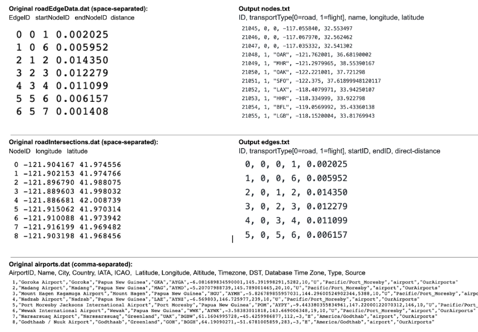
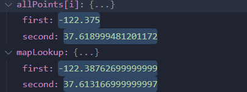
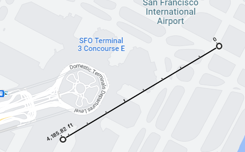
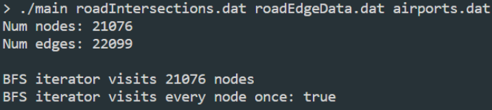
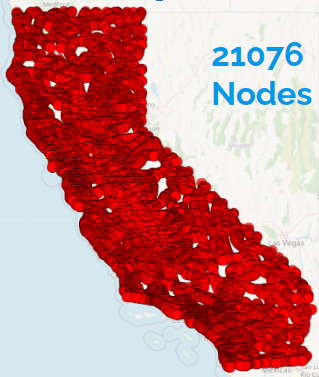
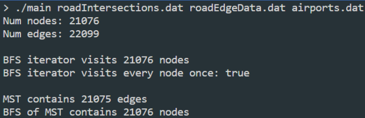
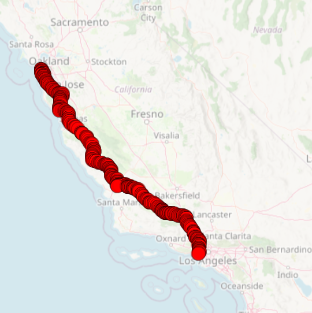

Shiv Gohil, Binh Minh Nguyen, Nuoyan Wang, Andrew Zhao 
Carl Evans, Brad Solomon, Thierry Ramais 
CS 225 
12 December 2022 
# CS225 Final Project Report  
## Introduction  
Throughout the process of this project, we aimed to answer the fundamental question: Using a dataset of road intersections and edges and a dataset of airport locations, how can we best implement a “Shortest-Route Finder” using a graph data structure and algorithms? Ultimately, we represented intersections and airports as nodes in our graph, with road connections and air flights as the edges. Moreover, having decided on using California as our map area, we needed to complete the following stages: data cleaning and parsing, a graph implementation, as well as graph algorithms (BFS, Kruskal’s and A-star). 
## Data Cleaning: (getCleanedData.cpp)
First, we need to retrieve the data from our online datasets, and convert its format in the following way, keeping the pertinent information for our routeFinder application: 

>Nodes: (NodeID, transportType[0=road, 1=flight], name, longitude, latitude) 
>Edges: (EdgeID, transportType[0=road, 1=flight], startID, endID, direct-distance)

In this manner, we can later create weighted edges, where the weight is determined by distance multiplied by different factors for air and ground travel. Here, distance is the euclidean distance between two points, measured in units of “degrees of longitude-latitude.” We later omit the curvature of the Earth when converting from these degrees into units of miles or km as the distances between California are small enough that the curvature is small.  

Having decided on this format, we begin data cleaning within the “getCleanedData.cpp” file. Our function takes input filenames for the 3 datasets containing the California intersections, California road edges, and the World airports. For each of these three datasets, we iterate through the .dat file line by line, separating each line into vectors of strings depending on the comma-separated or space-separated nature of the original data file. As we iterate through, we need to omit erroneous data, such as duplicating edges, self-looping edges, as well as all non-commercial and non-California airports. The data we want within each individual line-by-line vector is then selected and output into output nodes.txt and edges.txt files, according to the formats in bold above.  

Now, our output nodes.txt file contains the road intersection and airport nodes, while our edges.txt file contains the road edges between select intersections. We still need to create flight edges between airports. To do this, we make the assumption that each of our selected airports has a flight to-and-from every other airport. We want to append these flights as edges in our output edges.txt files. To accomplish this, we need to add a portion of code within the airport data cleaning, allowing us to store a vector of just the airport nodes we want. Then, we simply use a nested for loop to create edges between every pair of airports, which are then appended to our edges.txt file as strings on each line. 

>Input and Output Text format visualized: 

### KDTree:
In the final step of data cleaning, we want to append new road edges from each airport to the nearest intersection. In doing so, we complete our integration between the road network and the airport network, which allows us to seamlessly transition from driving to getting to an airport and taking a flight and vice versa. The best method that we figured out how to  accomplish our goals was by using the Kd-Tree that we created before in the “mp_mosiacs” assignment as we had already completed the findNearestNeighbor() function in said assignment.  

In our project, we made the entire process of finding and then creating these edges a separate function called connectGraphs() which takes in the index of the last edge created as an integer variable called currIdx and returns a vector of strings. This section of the code simply creates a vector of Points using the longitude and latitude of every intersection node and maps that Point to its node ID. We then call the Kd-tree constructor on that vector and loop through every single airport node; we can then use the longitude and latitude of the airport nodes to call findNearestNeighbor() and feed the result into our map. This returns us the ID of the closest intersection to said airport which can then be used to create an edge between the intersection and current airport with, ID = currIdx+1 type= 0 and weight=0 . The reason our weight is 0 is because the exact length is unknown, but should be small enough that is negligible and thus can be represented as a 0. This edge is then inserted into a vector of strings and currIdx is incremented for the next edge. When the loop completes, it simply returns the vector of all the edges to be used by the rest of the code which appends it to edges.txt.  

This current method is rather accurate, an example is shown below to prove this where allPoints is the airport location and mapLookup is the closest intersection with the points plotted on google maps:

>Airport to Closest Intersection Coordinates on Google Maps 

 

### Testing:
To test functionality for Data Cleaning, we implemented five test cases. The first test case just measures if the program created an edge from every airport to an intersection using the Kd-tree. The next two test cases are simple insertion cases of varying sizes that ensures that all of the relevant data are properly added from our files. However, the small test case only had Edge Data correction to remove any edges between non-existent nodes. The medium size test case not only has Edge Data correction but also Node Data Correction by removing invalid airport nodes. The fourth test case focuses more on eliminating on invalid edges such as self loops and duplicate edges and removing any airports that don't fit our required parameters. The last test case focuses on a larger dataset, where we test to make sure that the correct number of valid airports are included. We also test to make sure that there is indeed one flight connecting each pair of airports. Once all of these tests were passed we knew that our code would be able to correctly process the entire dataset.  

## Input Reading:
The next step in our assignment was to take all of the nodes and edges that were created by the Data Cleanup Algorithm and insert them into our graph. This part of the project was rather simple, it had one function called fullGraph which was a constructor for the fullGraph class. It took in a Graph reference and a vector of strings representing all the files a user may want to be inserted; however, the file order in the vector must go node, edge, node, edge, …. This was done so that if the user ever wished to have more than two types of travel types they could be easily inserted into the graph. For example, they could insert a plane, car, and train data type if they so wished to. The code first starts looping through the vector calling the helper function insertAllNodes and insertAllEdges which loops through the given file and inserts all the nodes and edges into the graph from the file. This is done by simply looping through the file one character at a time, and since we know what the data has been cleaned and what format should be, in that loop we can iterate through the line, converting each character either to an int or a double, and once we get all the info we insert it either as an edge or node and then we loop back until the file is empty. 

>Output of Input Reading Test Case 

### Testing:
Since fileParser.cpp is a pretty simple algorithm that inserts all the nodes and edges from the file, there are only two test cases of varying sizes that checks if all of the nodes and edges contained in the file are properly added. The small test case just tests with a file of 3 nodes and a file with 1 edge and then checks if all were added. The 2nd test case is a massive one that uses all the nodes/edges created by our sanitized code and also just checks if all of them were properly added/detected by our code. Since they both pass, we know this aspect of the code works.

### Graph Implementation:
To store our data as a graph, we had to implement a graph data structure. We chose to use an adjacency list implementation for two reasons. Firstly, we wanted quick access to a node’s neighbors for our pathfinding algorithm. Secondly, with such a large dataset, the O(n2) space complexity of adjacency matrices makes it infeasible to use.

## Graph Data Structure:
To store our data as a graph, we had to implement a graph data structure. We chose to use an adjacency list implementation for two reasons. Firstly, we wanted quick access to a node’s neighbors for our pathfinding algorithm. Secondly, with such a large dataset, the O(n2) space complexity of adjacency matrices makes it infeasible to use. However, our implementation differed from the in class approach as we decided to use vector indexes instead of pointers as the data sanitize code returned our edges and nodes in order. 

>Graph, and BFS Output 

## Testing

We test our basic get/insert functions like getAdj, getEdge, insertEdge, insertNode on valid graphs and on invalid (missing nodes, empty, etc) graphs. We make sure to try to read invalid nodes/edges and write invalid nodes/edges to ensure the error handling (whether be auto correct or exception throwing).

## Algorithms:

## BFS

Once we have set up our graph implementation, we needed to ensure that the graph could be correctly traversed. This means that a correctly implemented BFS Traversal should visit each node exactly once and the total number of nodes visited should equal the number of total nodes. Using this traversal, we can see that indeed our graph is correctly implemented if the number of traversed nodes is equal to the number of correct nodes in our cleaned dataset. This was not too difficult to implement as we have implemented traversals many times before. We simply had to create our own traversal class for the Graph that uses a queue of need to be visited and a vector of visited. Using these two data structures, our operator++ function can iterate through the graph in the proper fashion, adding nodes with each function call. 

>All of the Nodes Visited Visualized 

### Testing 

For this test, we used one example graph (connected, 5 nodes, 6 edges) with some backedges. This ensures that the graph will not revisit nodes, visit nodes early, or miss nodes. We also test the iterator on an empty graph to make sure it starts on the end iterator and doesn't move when incremented.

## Kruskal's:

We then wrote a Minimum Spanning Tree algorithm which could span the graph for our dataset. Between Prim’s and Kruskal’s algorithms, we ultimately settled on implementing Kruskal’s due to the fact that our later-mentioned A* algorithm shares many components to Prim’s, so we wanted some added variety. Here, Kruskal’s algorithm sorts the edges of the graph in increasing order of weight, and adds them to the minimum spanning tree starting from the lowest weights, while skipping over values which would lead to a cycle creation. Once all of the edges have been added, the algorithm terminates, returning the MST. Once again since this was  a simple algorithm that was not too difficult at all to be implemented. Especially since we went with the sorted list method where we just altered our operator< function for edges in order to use std::sort on a vector of edges. We also already implemented the Disjoint Set code we used in mp_mazes, so that made our lives easier.

>Kruskal's Output 

### Testing:
We used the Kruskal example from Fa22 CS225 lecture. This shows that it works for an average graph. We also tested it on an empty node and a single node graph. This ensures that it will generate an empty MST for those edge cases.

## A-star:
The A-star algorithm is a popular pathfinding algorithm that makes use of heuristics to look for the shortest path between nodes in a graph. The algorithm is defined in a*.cpp and under the function shortestPath. The function takes the graph to be used and starting and ending coordinates as parameters, and returns a vector of copied graph edges. To implement this function, a new data struct was defined in "a*.h" called Cell, a structure that contains a geographical location that's stored in a copied graph node, a pointer to its "parent" Cell which replicates a backwards linked list, and an F-score. How the A-star algorithm works and why it's unique from other traversals is that it intelligently looks for the next node in the shortest path by calculating the cost to move from the current node to the potential next node and summing that with the estimated cost of moving from the potential next node to the end with an approximation heuristic. For our approximation heuristic, we used the Euclidean distance between the potential next node and end node in miles divided by the average speed limit in America (55 mph) to get an estimate of the time it takes to get from that node to the end. The sum of this estimated cost and calculated cost is known as the F-score, and A-star always chooses the Cell with the smallest F-score to proceed. The algorithm also uses an open and closed list to know which Cells have already been processed and what Cells haven’t. Whenever the ending node is found, the path is generated by traversing through the backwards linked list in Cell->parent. Because the linked list stores the correct path in reverse order, we can simply flip the generated path of edges to get the path in correct order, which is what’s returned. Cells are each allocated on heap memory and when the ending node is found, they are deallocated. A-star is costly in regards to time as it runs in O(n^2) time, since for every node that is checked all its adjacent nodes are checked again to verify there aren’t better paths then the current one. 

>A-Star Path visualized 

### Testing:
For testing, two test cases were written that covered a basic minimum spanning five node graph with two edge paths and a more complex six node graph with multiple paths between nodes and edges of different weights. I found it unnecessary to run A-star on edge cases of single node or empty graphs since it would be pointless to run A-star in those cases. The first test case ensured that A-star could do basic traversal and pathfinding as well as tested the KDtree implementation of being able to find the closest node to a generic pair of coordinates. The second test case tested the algorithm’s intelligence, testing that the algorithm would create the correct shortest path between nodes with multiple paths between them.

## Conlcusion
Overall we were able to complete our project and answer the main part of our leading question. We successfully sanitized our data of all the intersections, roads, and commercial airports of California, and using that data, we inserted in a graph and ran the different graph algorithms we created. For example, we had the user input the coordinates of their two desired destinations in latitude and longitude, and using the A-Star Algorithm, we created a list of  nodes to follow that give a weighted shortest path that can traverse seamlessly between driving and flying. Additionally, this entire code structure can be very easily retrofitted to accept different traversal types such as trains or busses, however, the only issue is that the data sanitize portion would need some altering to accommodate the unique traversal types as each traversal type have their own challenges and characteristics that might create an invalid data type. Additionally, some extra functionality could be added to visualize what edges must be taken with A-Start in order to give the user a better understanding of where to go.

In completing this assignment, we have all gained significant experience in deploying our coding expertise in a professional group environment. We successfully completed a multifaceted project that utilizes three distinct data structures, implemented its own test suite, and created expansive documentation so that any user can easily utilize and understand our code. However,  that does not mean there were no challenges in the process. We sometimes had issues when it came to dividing up work and finishing before deadlines, as we would be waiting on someone to finish their part. We would try to help each other when this became an issue, but it would prove to be difficult to try to understand someone else’s code while they are in the process of writing it. One way we could’ve tried to remedy the issue would be to not only discuss what we implemented during our weekly meetings but also how it was done so. This way every member of the group can understand exactly what the code does so that if a bug or an issue does arise, they can quickly mitigate it instead of waiting for a response from the one who had written it. Furthermore, while our weekly meetings were a useful tool that greatly aided us, we should have also created smaller meetings between team members whose code greatly relied on each other. This would have let those team members work together more efficiently and better understand each other’s code so that we could've made a more robust algorithm far more quickly. 

